# 🦅 WronAI - Kompletna Dokumentacja Tworzenia LLM

## 📋 Spis Treści
1. [Wprowadzenie i Architektura](#wprowadzenie)
2. [Diagramy Procesu](#diagramy)
3. [Step-by-Step Implementation](#implementation)
4. [Źródła Danych dla ARM/Edge](#data-sources)
5. [Optymalizacje Edge Computing](#edge-optimizations)
6. [Integracja z Golang](#golang-integration)
7. [Monitoring i Deployment](#monitoring)

---

## 🎯 Wprowadzenie i Architektura {#wprowadzenie}

### Cele WronAI
- **Język**: Specjalizacja w języku polskim
- **Platform**: Optymalizacja dla ARM (Raspberry Pi, Jetson)
- **Kod**: Wsparcie dla Python, Bash, SQL, Go, DSL
- **Rozmiar**: 50M-500M parametrów (edge-friendly)
- **Latencja**: <100ms inference na RPi 4

### Kluczowe Decyzje Architektoniczne

| Aspekt | Wybór | Uzasadnienie |
|--------|-------|--------------|
| **Architektura** | Transformer Decoder-only | Standardowy wybór dla LLM |
| **Rozmiar** | 50M-500M parametrów | Balans jakość/wydajność dla edge |
| **Tokenizer** | SentencePiece BPE | Dobry dla polskiego + kod |
| **Precyzja** | FP16/INT4 | Optymalizacja pamięci |
| **Kontekst** | 2048-4096 tokenów | Wystarczający dla większości zadań |

---

## 📊 Diagramy Procesu {#diagramy}

### 1. Ogólny Pipeline Tworzenia LLM

```mermaid
graph TD
    A[📚 Zbieranie Danych] --> B[🔧 Preprocessing]
    B --> C[🎯 Tokenizacja]
    C --> D[🏗️ Architektura Modelu]
    D --> E[⚡ Pre-training]
    E --> F[🎨 Fine-tuning SFT]
    F --> G[🏆 RLHF/DPO]
    G --> H[📦 Kwantyzacja]
    H --> I[🚀 Deployment]
    
    subgraph "Dane Źródłowe"
    A1[Polski Korpus<br/>OSCAR, mC4]
    A2[Kod Źródłowy<br/>GitHub, Stack]
    A3[Instrukcje<br/>Alpaca, OASST]
    end
    
    A1 --> A
    A2 --> A
    A3 --> A
    
    subgraph "Platformy Docelowe"
    I1[🍇 Raspberry Pi]
    I2[🤖 Jetson Nano]
    I3[💻 ARM Mac]
    I4[☁️ Cloud ARM]
    end
    
    I --> I1
    I --> I2
    I --> I3
    I --> I4
```



### 2. Architektura Transformer dla Edge


### 3. Pipeline Danych

```mermaid
flowchart LR
    subgraph "Raw Data Sources"
    WIKI[📖 Wikipedia PL]
    NEWS[📰 Polish News]
    BOOKS[📚 Literature]
    CODE[💻 GitHub Code]
    DOCS[📄 Documentation]
    end
    
    subgraph "Preprocessing"
    CLEAN[🧹 Text Cleaning]
    FILTER[🔍 Quality Filter]
    DEDUP[🔄 Deduplication]
    end
    
    subgraph "Tokenization"
    SENT[📝 SentencePiece]
    CHUNK[✂️ Chunking]
    PACK[📦 Packing]
    end
    
    subgraph "Training Ready"
    TRAIN[🎯 Training Set]
    VALID[✅ Validation Set]
    TEST[🧪 Test Set]
    end
    
    WIKI --> CLEAN
    NEWS --> CLEAN
    BOOKS --> CLEAN
    CODE --> CLEAN
    DOCS --> CLEAN
    
    CLEAN --> FILTER
    FILTER --> DEDUP
    DEDUP --> SENT
    SENT --> CHUNK
    CHUNK --> PACK
    
    PACK --> TRAIN
    PACK --> VALID
    PACK --> TEST
```



### 4. Edge Computing Considerations


---

## 🚀 Step-by-Step Implementation {#implementation}

### Krok 1: Przygotowanie Środowiska

```bash
# 1.1 Podstawowe narzędzia
sudo apt update && sudo apt upgrade -y
sudo apt install git python3-pip cmake build-essential

# 1.2 Python environment
python3 -m venv wronai_env
source wronai_env/bin/activate

# 1.3 PyTorch dla ARM
pip install torch torchvision torchaudio --index-url https://download.pytorch.org/whl/cpu

# 1.4 ML biblioteki
pip install transformers datasets tokenizers sentencepiece
pip install accelerate wandb huggingface_hub
pip install numpy pandas scikit-learn matplotlib seaborn

# 1.5 Opcjonalne optimizacje
pip install onnx onnxruntime  # Dla ONNX inference
pip install bitsandbytes     # Dla quantization (jeśli ARM support)
```

### Krok 2: Zbieranie i Przygotowanie Danych

#### 2.1 Polskie korpusy tekstowe
```python
from datasets import load_dataset

# OSCAR - największy korpus polski
oscar_pl = load_dataset("oscar-corpus/OSCAR-2301", "pl", 
                       split="train", streaming=True)

# mC4 - Common Crawl
mc4_pl = load_dataset("mc4", "pl", split="train", streaming=True)

# Wikipedia polska
wiki_pl = load_dataset("wikipedia", "20231101.pl", split="train")

# Literatura polska
polish_lit = load_dataset("allegro/polish-literature", split="train")

# Newsy polskie
polish_news = load_dataset("clarin-pl/polemo2-official", split="train")
```

#### 2.2 Kod źródłowy (Python, Bash, SQL, Go)
```python
# The Stack - kod z GitHub
stack_python = load_dataset("bigcode/the-stack", 
                           data_dir="data/python", 
                           split="train", streaming=True)

stack_shell = load_dataset("bigcode/the-stack",
                          data_dir="data/shell",
                          split="train", streaming=True)

stack_sql = load_dataset("bigcode/the-stack",
                        data_dir="data/sql", 
                        split="train", streaming=True)

stack_go = load_dataset("bigcode/the-stack",
                       data_dir="data/go",
                       split="train", streaming=True)

# CodeSearchNet
code_search = load_dataset("code_search_net", 
                          languages=["python", "go"],
                          split="train")

# GitHub Code deduplikowany
github_code = load_dataset("codeparrot/github-code-clean",
                          languages=["Python", "Shell", "Go", "SQL"],
                          split="train", streaming=True)
```

#### 2.3 Dane instrukcyjne
```python
# Polski Alpaca
polish_alpaca = load_dataset("mikechatgpt/polish_alpaca", split="train")

# OpenAssistant w języku polskim
oasst_pl = load_dataset("OpenAssistant/oasst1", split="train")
oasst_pl = oasst_pl.filter(lambda x: x['lang'] == 'pl')

# Code Alpaca dla programowania
code_alpaca = load_dataset("sahil2801/CodeAlpaca-20k", split="train")

# SQL instrukcje
sql_instruct = load_dataset("b-mc2/sql-create-context", split="train")
```

### Krok 3: Preprocessing i Quality Control

```python
import re
from typing import List, Dict, Optional

class WronDataProcessor:
    def __init__(self, min_length=50, max_length=10000):
        self.min_length = min_length
        self.max_length = max_length
        
    def clean_text(self, text: str) -> Optional[str]:
        """Czyszczenie tekstu z artefaktów"""
        if not text or len(text) < self.min_length:
            return None
            
        # Usuwanie kontrolnych znaków
        text = re.sub(r'[\x00-\x08\x0B\x0C\x0E-\x1F\x7F]', '', text)
        
        # Normalizacja whitespace
        text = re.sub(r'\s+', ' ', text)
        text = re.sub(r'\n\s*\n\s*\n+', '\n\n', text)
        
        # Usuwanie zbyt długich linii (spam)
        lines = text.split('\n')
        filtered_lines = [line for line in lines if len(line) < 1000]
        text = '\n'.join(filtered_lines)
        
        if len(text) > self.max_length:
            return None
            
        return text.strip()
    
    def filter_polish_content(self, text: str) -> bool:
        """Sprawdzanie czy tekst jest po polsku"""
        polish_chars = 'ąćęłńóśźż'
        polish_count = sum(1 for c in text.lower() if c in polish_chars)
        return polish_count / len(text) > 0.01  # Próg 1%
    
    def classify_content_type(self, text: str) -> str:
        """Klasyfikacja typu zawartości"""
        if re.search(r'def\s+\w+\s*\(|import\s+\w+|class\s+\w+', text):
            return 'python'
        elif re.search(r'#!/bin/bash|#!/bin/sh|\$\{.*\}', text):
            return 'bash'
        elif re.search(r'SELECT|INSERT|UPDATE|DELETE|CREATE TABLE', text, re.IGNORECASE):
            return 'sql'
        elif re.search(r'package\s+main|func\s+\w+\s*\(|import\s*\(', text):
            return 'golang'
        elif self.filter_polish_content(text):
            return 'polish_text'
        else:
            return 'other'
```

### Krok 4: Tokenizer Training

```python
import sentencepiece as spm
from pathlib import Path

def train_wron_tokenizer():
    """Trenowanie custom tokenizera dla WronAI"""
    
    # Przygotowanie korpusu treningowego
    corpus_files = []
    
    # Sample z każdego typu danych
    samples = {
        'polish_text': 1000000,    # 1M próbek polskiego tekstu
        'python': 200000,          # 200k próbek Python
        'bash': 50000,             # 50k próbek Bash
        'sql': 30000,              # 30k próbek SQL
        'golang': 100000,          # 100k próbek Go
    }
    
    # Tworzenie pliku treningowego
    with open('wron_corpus.txt', 'w', encoding='utf-8') as f:
        for data_type, count in samples.items():
            print(f"Collecting {count} samples of {data_type}...")
            # Tu by była logika zbierania próbek z datasetów
            # f.write(sample_text + '\n')
    
    # Trenowanie SentencePiece
    spm.SentencePieceTrainer.train(
        input='wron_corpus.txt',
        model_prefix='wronai_tokenizer',
        vocab_size=32000,
        character_coverage=0.9995,
        model_type='bpe',
        max_sentence_length=4192,
        shuffle_input_sentence=True,
        
        # Specjalne tokeny
        user_defined_symbols=[
            # Chat markers
            '<user>', '</user>', '<assistant>', '</assistant>',
            # Code markers  
            '<code>', '</code>', '<python>', '</python>',
            '<bash>', '</bash>', '<sql>', '</sql>', '<go>', '</go>',
            # Special tokens
            '<think>', '</think>', '<result>', '</result>',
            # Function tokens
            '<func>', '</func>', '<class>', '</class>',
            # Error handling
            '<error>', '</error>', '<warning>', '</warning>'
        ],
        
        # Polskie znaki
        normalization_rule_name='nmt_nfkc_cf',
        split_by_unicode_script=True,
        split_by_whitespace=True,
        split_by_number=True,
        
        # Parametry BPE
        split_digits=True,
        allow_whitespace_only_pieces=True,
        byte_fallback=True,
    )
    
    print("✅ Tokenizer trained successfully!")
    return 'wronai_tokenizer.model'
```

### Krok 5: Architektura Modelu

```python
import torch
import torch.nn as nn
import torch.nn.functional as F
import math
from typing import Optional, Tuple

class WronAIConfig:
    """Konfiguracja modelu WronAI"""
    def __init__(self, 
                 vocab_size: int = 32000,
                 d_model: int = 512,
                 n_layers: int = 8,
                 n_heads: int = 8,
                 n_kv_heads: Optional[int] = None,  # Dla GQA
                 max_seq_len: int = 2048,
                 intermediate_size: Optional[int] = None,
                 dropout: float = 0.0,
                 rope_theta: float = 10000.0,
                 layer_norm_eps: float = 1e-5):
        
        self.vocab_size = vocab_size
        self.d_model = d_model
        self.n_layers = n_layers
        self.n_heads = n_heads
        self.n_kv_heads = n_kv_heads or n_heads  # Default to MHA
        self.max_seq_len = max_seq_len
        self.intermediate_size = intermediate_size or int(d_model * 2.67)  # SwiGLU ratio
        self.dropout = dropout
        self.rope_theta = rope_theta
        self.layer_norm_eps = layer_norm_eps
        
        # Validate GQA configuration
        assert self.n_heads % self.n_kv_heads == 0, "n_heads must be divisible by n_kv_heads"

class RMSNorm(nn.Module):
    """Root Mean Square Layer Normalization"""
    def __init__(self, hidden_size: int, eps: float = 1e-6):
        super().__init__()
        self.weight = nn.Parameter(torch.ones(hidden_size))
        self.variance_epsilon = eps

    def forward(self, hidden_states: torch.Tensor) -> torch.Tensor:
        input_dtype = hidden_states.dtype
        hidden_states = hidden_states.to(torch.float32)
        variance = hidden_states.pow(2).mean(-1, keepdim=True)
        hidden_states = hidden_states * torch.rsqrt(variance + self.variance_epsilon)
        return self.weight * hidden_states.to(input_dtype)

class RotaryPositionalEmbedding(nn.Module):
    """Rotary Position Embedding (RoPE)"""
    def __init__(self, dim: int, max_seq_len: int, theta: float = 10000.0):
        super().__init__()
        self.dim = dim
        self.max_seq_len = max_seq_len
        self.theta = theta
        
        # Precompute frequencies
        inv_freq = 1.0 / (theta ** (torch.arange(0, dim, 2).float() / dim))
        self.register_buffer('inv_freq', inv_freq, persistent=False)
        
    def forward(self, x: torch.Tensor, seq_len: int) -> Tuple[torch.Tensor, torch.Tensor]:
        t = torch.arange(seq_len, device=x.device, dtype=self.inv_freq.dtype)
        freqs = torch.outer(t, self.inv_freq)
        
        cos = freqs.cos()
        sin = freqs.sin()
        
        return cos, sin

def apply_rotary_pos_emb(q: torch.Tensor, k: torch.Tensor, 
                        cos: torch.Tensor, sin: torch.Tensor) -> Tuple[torch.Tensor, torch.Tensor]:
    """Apply rotary position embedding to query and key tensors"""
    def rotate_half(x):
        x1, x2 = x[..., :x.shape[-1]//2], x[..., x.shape[-1]//2:]
        return torch.cat((-x2, x1), dim=-1)
    
    q_embed = (q * cos) + (rotate_half(q) * sin)
    k_embed = (k * cos) + (rotate_half(k) * sin)
    
    return q_embed, k_embed

class WronAttention(nn.Module):
    """Multi-Head Attention with Grouped Query Attention (GQA)"""
    def __init__(self, config: WronAIConfig):
        super().__init__()
        self.config = config
        self.hidden_size = config.d_model
        self.num_heads = config.n_heads
        self.num_kv_heads = config.n_kv_heads
        self.head_dim = self.hidden_size // self.num_heads
        self.num_key_value_groups = self.num_heads // self.num_kv_heads
        
        # Linear projections
        self.q_proj = nn.Linear(self.hidden_size, self.num_heads * self.head_dim, bias=False)
        self.k_proj = nn.Linear(self.hidden_size, self.num_kv_heads * self.head_dim, bias=False)
        self.v_proj = nn.Linear(self.hidden_size, self.num_kv_heads * self.head_dim, bias=False)
        self.o_proj = nn.Linear(self.num_heads * self.head_dim, self.hidden_size, bias=False)
        
        # RoPE
        self.rotary_emb = RotaryPositionalEmbedding(
            self.head_dim, config.max_seq_len, config.rope_theta
        )
        
    def forward(self, hidden_states: torch.Tensor, 
                attention_mask: Optional[torch.Tensor] = None,
                kv_cache: Optional[Tuple[torch.Tensor, torch.Tensor]] = None) -> torch.Tensor:
        
        batch_size, seq_len, _ = hidden_states.size()
        
        # Project to Q, K, V
        query_states = self.q_proj(hidden_states)
        key_states = self.k_proj(hidden_states)
        value_states = self.v_proj(hidden_states)
        
        # Reshape for multi-head attention
        query_states = query_states.view(batch_size, seq_len, self.num_heads, self.head_dim).transpose(1, 2)
        key_states = key_states.view(batch_size, seq_len, self.num_kv_heads, self.head_dim).transpose(1, 2)
        value_states = value_states.view(batch_size, seq_len, self.num_kv_heads, self.head_dim).transpose(1, 2)
        
        # Apply RoPE
        cos, sin = self.rotary_emb(query_states, seq_len)
        query_states, key_states = apply_rotary_pos_emb(query_states, key_states, cos, sin)
        
        # Handle KV cache
        if kv_cache is not None:
            cache_k, cache_v = kv_cache
            key_states = torch.cat([cache_k, key_states], dim=2)
            value_states = torch.cat([cache_v, value_states], dim=2)
        
        # Repeat KV heads for GQA
        if self.num_key_value_groups > 1:
            key_states = key_states.repeat_interleave(self.num_key_value_groups, dim=1)
            value_states = value_states.repeat_interleave(self.num_key_value_groups, dim=1)
        
        # Scaled dot-product attention
        attn_weights = torch.matmul(query_states, key_states.transpose(2, 3)) / math.sqrt(self.head_dim)
        
        # Apply causal mask
        if attention_mask is not None:
            attn_weights = attn_weights + attention_mask
        
        attn_weights = F.softmax(attn_weights, dim=-1)
        attn_output = torch.matmul(attn_weights, value_states)
        
        # Reshape and project output
        attn_output = attn_output.transpose(1, 2).contiguous().view(batch_size, seq_len, self.hidden_size)
        attn_output = self.o_proj(attn_output)
        
        return attn_output, (key_states, value_states)

class WronMLP(nn.Module):
    """SwiGLU Feed-Forward Network"""
    def __init__(self, config: WronAIConfig):
        super().__init__()
        self.config = config
        self.hidden_size = config.d_model
        self.intermediate_size = config.intermediate_size
        
        self.gate_proj = nn.Linear(self.hidden_size, self.intermediate_size, bias=False)
        self.up_proj = nn.Linear(self.hidden_size, self.intermediate_size, bias=False)
        self.down_proj = nn.Linear(self.intermediate_size, self.hidden_size, bias=False)
        
    def forward(self, x: torch.Tensor) -> torch.Tensor:
        gate = F.silu(self.gate_proj(x))  # SiLU activation
        up = self.up_proj(x)
        return self.down_proj(gate * up)

class WronDecoderLayer(nn.Module):
    """Single Transformer Decoder Layer"""
    def __init__(self, config: WronAIConfig):
        super().__init__()
        self.hidden_size = config.d_model
        
        self.self_attn = WronAttention(config)
        self.mlp = WronMLP(config)
        self.input_layernorm = RMSNorm(config.d_model, eps=config.layer_norm_eps)
        self.post_attention_layernorm = RMSNorm(config.d_model, eps=config.layer_norm_eps)
        
    def forward(self, hidden_states: torch.Tensor,
                attention_mask: Optional[torch.Tensor] = None,
                kv_cache: Optional[Tuple[torch.Tensor, torch.Tensor]] = None) -> torch.Tensor:
        
        # Self-attention with residual connection
        residual = hidden_states
        hidden_states = self.input_layernorm(hidden_states)
        hidden_states, new_kv_cache = self.self_attn(hidden_states, attention_mask, kv_cache)
        hidden_states = residual + hidden_states
        
        # Feed-forward with residual connection
        residual = hidden_states
        hidden_states = self.post_attention_layernorm(hidden_states)
        hidden_states = self.mlp(hidden_states)
        hidden_states = residual + hidden_states
        
        return hidden_states, new_kv_cache

class WronAIModel(nn.Module):
    """WronAI Language Model"""
    def __init__(self, config: WronAIConfig):
        super().__init__()
        self.config = config
        self.vocab_size = config.vocab_size
        
        # Token embeddings
        self.embed_tokens = nn.Embedding(config.vocab_size, config.d_model)
        
        # Transformer layers
        self.layers = nn.ModuleList([
            WronDecoderLayer(config) for _ in range(config.n_layers)
        ])
        
        # Final normalization
        self.norm = RMSNorm(config.d_model, eps=config.layer_norm_eps)
        
        # Output projection (weight tied with embeddings)
        self.lm_head = nn.Linear(config.d_model, config.vocab_size, bias=False)
        self.lm_head.weight = self.embed_tokens.weight  # Weight tying
        
        # Initialize weights
        self.apply(self._init_weights)
        
    def _init_weights(self, module):
        if isinstance(module, nn.Linear):
            torch.nn.init.normal_(module.weight, mean=0.0, std=0.02)
            if module.bias is not None:
                torch.nn.init.zeros_(module.bias)
        elif isinstance(module, nn.Embedding):
            torch.nn.init.normal_(module.weight, mean=0.0, std=0.02)
    
    def forward(self, input_ids: torch.Tensor,
                attention_mask: Optional[torch.Tensor] = None,
                kv_caches: Optional[list] = None) -> torch.Tensor:
        
        batch_size, seq_len = input_ids.shape
        
        # Token embeddings
        hidden_states = self.embed_tokens(input_ids)
        
        # Create causal mask
        if attention_mask is None:
            attention_mask = torch.triu(
                torch.full((seq_len, seq_len), float('-inf'), device=input_ids.device),
                diagonal=1
            )[None, None, :, :]
        
        # Initialize KV caches if not provided
        if kv_caches is None:
            kv_caches = [None] * len(self.layers)
        
        new_kv_caches = []
        
        # Pass through transformer layers
        for i, (layer, kv_cache) in enumerate(zip(self.layers, kv_caches)):
            hidden_states, new_kv_cache = layer(hidden_states, attention_mask, kv_cache)
            new_kv_caches.append(new_kv_cache)
        
        # Final normalization
        hidden_states = self.norm(hidden_states)
        
        # Output projection
        logits = self.lm_head(hidden_states)
        
        return logits, new_kv_caches

# Przykład użycia
def create_wronai_model(model_size: str = "mini") -> WronAIModel:
    """Create WronAI model with predefined configurations"""
    
    configs = {
        "nano": WronAIConfig(
            vocab_size=32000,
            d_model=384,
            n_layers=6,
            n_heads=6,
            n_kv_heads=2,  # GQA 3:1 ratio
            max_seq_len=2048,
        ),
        "micro": WronAIConfig(
            vocab_size=32000,
            d_model=512,
            n_layers=8,
            n_heads=8,
            n_kv_heads=2,  # GQA 4:1 ratio
            max_seq_len=2048,
        ),
        "mini": WronAIConfig(
            vocab_size=32000,
            d_model=768,
            n_layers=12,
            n_heads=12,
            n_kv_heads=4,  # GQA 3:1 ratio
            max_seq_len=4096,
        ),
    }
    
    config = configs[model_size]
    model = WronAIModel(config)
    
    # Print model statistics
    total_params = sum(p.numel() for p in model.parameters())
    trainable_params = sum(p.numel() for p in model.parameters() if p.requires_grad)
    
    print(f"✅ WronAI-{model_size} created:")
    print(f"  📊 Total parameters: {total_params:,}")
    print(f"  🎯 Trainable parameters: {trainable_params:,}")
    print(f"  💾 Estimated size (FP16): {total_params * 2 / 1024**2:.1f} MB")
    print(f"  🏗️ Architecture: {config
```
