# 🦅 WronAI - Kompletna Dokumentacja Tworzenia LLM

## 📋 Spis Treści
1. [Wprowadzenie i Architektura](#wprowadzenie)
2. [Diagramy Procesu](#diagramy)
3. [Step-by-Step Implementation](#implementation)
4. [Źródła Danych dla ARM/Edge](#data-sources)
5. [Optymalizacje Edge Computing](#edge-optimizations)
6. [Integracja z Golang](#golang-integration)
7. [Monitoring i Deployment](#monitoring)

---

## 🎯 Wprowadzenie i Architektura {#wprowadzenie}

### Cele WronAI
- **Język**: Specjalizacja w języku polskim
- **Platform**: Optymalizacja dla ARM (Raspberry Pi, Jetson)
- **Kod**: Wsparcie dla Python, Bash, SQL, Go, DSL
- **Rozmiar**: 50M-500M parametrów (edge-friendly)
- **Latencja**: <100ms inference na RPi 4

### Kluczowe Decyzje Architektoniczne

| Aspekt | Wybór | Uzasadnienie |
|--------|-------|--------------|
| **Architektura** | Transformer Decoder-only | Standardowy wybór dla LLM |
| **Rozmiar** | 50M-500M parametrów | Balans jakość/wydajność dla edge |
| **Tokenizer** | SentencePiece BPE | Dobry dla polskiego + kod |
| **Precyzja** | FP16/INT4 | Optymalizacja pamięci |
| **Kontekst** | 2048-4096 tokenów | Wystarczający dla większości zadań |

---

## 📊 Diagramy Procesu {#diagramy}

### 1. Ogólny Pipeline Tworzenia LLM

```mermaid
graph TD
    A[📚 Zbieranie Danych] --> B[🔧 Preprocessing]
    B --> C[🎯 Tokenizacja]
    C --> D[🏗️ Architektura Modelu]
    D --> E[⚡ Pre-training]
    E --> F[🎨 Fine-tuning SFT]
    F --> G[🏆 RLHF/DPO]
    G --> H[📦 Kwantyzacja]
    H --> I[🚀 Deployment]
    
    subgraph "Dane Źródłowe"
    A1[Polski Korpus<br/>OSCAR, mC4]
    A2[Kod Źródłowy<br/>GitHub, Stack]
    A3[Instrukcje<br/>Alpaca, OASST]
    end
    
    A1 --> A
    A2 --> A
    A3 --> A
    
    subgraph "Platformy Docelowe"
    I1[🍇 Raspberry Pi]
    I2[🤖 Jetson Nano]
    I3[💻 ARM Mac]
    I4[☁️ Cloud ARM]
    end
    
    I --> I1
    I --> I2
    I --> I3
    I --> I4
```



### 2. Architektura Transformer dla Edge


### 3. Pipeline Danych

```mermaid
flowchart LR
    subgraph "Raw Data Sources"
    WIKI[📖 Wikipedia PL]
    NEWS[📰 Polish News]
    BOOKS[📚 Literature]
    CODE[💻 GitHub Code]
    DOCS[📄 Documentation]
    end
    
    subgraph "Preprocessing"
    CLEAN[🧹 Text Cleaning]
    FILTER[🔍 Quality Filter]
    DEDUP[🔄 Deduplication]
    end
    
    subgraph "Tokenization"
    SENT[📝 SentencePiece]
    CHUNK[✂️ Chunking]
    PACK[📦 Packing]
    end
    
    subgraph "Training Ready"
    TRAIN[🎯 Training Set]
    VALID[✅ Validation Set]
    TEST[🧪 Test Set]
    end
    
    WIKI --> CLEAN
    NEWS --> CLEAN
    BOOKS --> CLEAN
    CODE --> CLEAN
    DOCS --> CLEAN
    
    CLEAN --> FILTER
    FILTER --> DEDUP
    DEDUP --> SENT
    SENT --> CHUNK
    CHUNK --> PACK
    
    PACK --> TRAIN
    PACK --> VALID
    PACK --> TEST
```



### 4. Edge Computing Considerations


---

## 🚀 Step-by-Step Implementation {#implementation}

### Krok 1: Przygotowanie Środowiska

```bash
# 1.1 Podstawowe narzędzia
sudo apt update && sudo apt upgrade -y
sudo apt install git python3-pip cmake build-essential

# 1.2 Python environment
python3 -m venv wronai_env
source wronai_env/bin/activate

# 1.3 PyTorch dla ARM
pip install torch torchvision torchaudio --index-url https://download.pytorch.org/whl/cpu

# 1.4 ML biblioteki
pip install transformers datasets tokenizers sentencepiece
pip install accelerate wandb huggingface_hub
pip install numpy pandas scikit-learn matplotlib seaborn

# 1.5 Opcjonalne optimizacje
pip install onnx onnxruntime  # Dla ONNX inference
pip install bitsandbytes     # Dla quantization (jeśli ARM support)
```

### Krok 2: Zbieranie i Przygotowanie Danych

#### 2.1 Polskie korpusy tekstowe
```python
from datasets import load_dataset

# OSCAR - największy korpus polski
oscar_pl = load_dataset("oscar-corpus/OSCAR-2301", "pl", 
                       split="train", streaming=True)

# mC4 - Common Crawl
mc4_pl = load_dataset("mc4", "pl", split="train", streaming=True)

# Wikipedia polska
wiki_pl = load_dataset("wikipedia", "20231101.pl", split="train")

# Literatura polska
polish_lit = load_dataset("allegro/polish-literature", split="train")

# Newsy polskie
polish_news = load_dataset("clarin-pl/polemo2-official", split="train")
```

#### 2.2 Kod źródłowy (Python, Bash, SQL, Go)
```python
# The Stack - kod z GitHub
stack_python = load_dataset("bigcode/the-stack", 
                           data_dir="data/python", 
                           split="train", streaming=True)

stack_shell = load_dataset("bigcode/the-stack",
                          data_dir="data/shell",
                          split="train", streaming=True)

stack_sql = load_dataset("bigcode/the-stack",
                        data_dir="data/sql", 
                        split="train", streaming=True)

stack_go = load_dataset("bigcode/the-stack",
                       data_dir="data/go",
                       split="train", streaming=True)

# CodeSearchNet
code_search = load_dataset("code_search_net", 
                          languages=["python", "go"],
                          split="train")

# GitHub Code deduplikowany
github_code = load_dataset("codeparrot/github-code-clean",
                          languages=["Python", "Shell", "Go", "SQL"],
                          split="train", streaming=True)
```

#### 2.3 Dane instrukcyjne
```python
# Polski Alpaca
polish_alpaca = load_dataset("mikechatgpt/polish_alpaca", split="train")

# OpenAssistant w języku polskim
oasst_pl = load_dataset("OpenAssistant/oasst1", split="train")
oasst_pl = oasst_pl.filter(lambda x: x['lang'] == 'pl')

# Code Alpaca dla programowania
code_alpaca = load_dataset("sahil2801/CodeAlpaca-20k", split="train")

# SQL instrukcje
sql_instruct = load_dataset("b-mc2/sql-create-context", split="train")
```

### Krok 3: Preprocessing i Quality Control

```python
import re
from typing import List, Dict, Optional

class WronDataProcessor:
    def __init__(self, min_length=50, max_length=10000):
        self.min_length = min_length
        self.max_length = max_length
        
    def clean_text(self, text: str) -> Optional[str]:
        """Czyszczenie tekstu z artefaktów"""
        if not text or len(text) < self.min_length:
            return None
            
        # Usuwanie kontrolnych znaków
        text = re.sub(r'[\x00-\x08\x0B\x0C\x0E-\x1F\x7F]', '', text)
        
        # Normalizacja whitespace
        text = re.sub(r'\s+', ' ', text)
        text = re.sub(r'\n\s*\n\s*\n+', '\n\n', text)
        
        # Usuwanie zbyt długich linii (spam)
        lines = text.split('\n')
        filtered_lines = [line for line in lines if len(line) < 1000]
        text = '\n'.join(filtered_lines)
        
        if len(text) > self.max_length:
            return None
            
        return text.strip()
    
    def filter_polish_content(self, text: str) -> bool:
        """Sprawdzanie czy tekst jest po polsku"""
        polish_chars = 'ąćęłńóśźż'
        polish_count = sum(1 for c in text.lower() if c in polish_chars)
        return polish_count / len(text) > 0.01  # Próg 1%
    
    def classify_content_type(self, text: str) -> str:
        """Klasyfikacja typu zawartości"""
        if re.search(r'def\s+\w+\s*\(|import\s+\w+|class\s+\w+', text):
            return 'python'
        elif re.search(r'#!/bin/bash|#!/bin/sh|\$\{.*\}', text):
            return 'bash'
        elif re.search(r'SELECT|INSERT|UPDATE|DELETE|CREATE TABLE', text, re.IGNORECASE):
            return 'sql'
        elif re.search(r'package\s+main|func\s+\w+\s*\(|import\s*\(', text):
            return 'golang'
        elif self.filter_polish_content(text):
            return 'polish_text'
        else:
            return 'other'
```

### Krok 4: Tokenizer Training

```python
import sentencepiece as spm
from pathlib import Path

def train_wron_tokenizer():
    """Trenowanie custom tokenizera dla WronAI"""
    
    # Przygotowanie korpusu treningowego
    corpus_files = []
    
    # Sample z każdego typu danych
    samples = {
        'polish_text': 1000000,    # 1M próbek polskiego tekstu
        'python': 200000,          # 200k próbek Python
        'bash': 50000,             # 50k próbek Bash
        'sql': 30000,              # 30k próbek SQL
        'golang': 100000,          # 100k próbek Go
    }
    
    # Tworzenie pliku treningowego
    with open('wron_corpus.txt', 'w', encoding='utf-8') as f:
        for data_type, count in samples.items():
            print(f"Collecting {count} samples of {data_type}...")
            # Tu by była logika zbierania próbek z datasetów
            # f.write(sample_text + '\n')
    
    # Trenowanie SentencePiece
    spm.SentencePieceTrainer.train(
        input='wron_corpus.txt',
        model_prefix='wronai_tokenizer',
        vocab_size=32000,
        character_coverage=0.9995,
        model_type='bpe',
        max_sentence_length=4192,
        shuffle_input_sentence=True,
        
        # Specjalne tokeny
        user_defined_symbols=[
            # Chat markers
            '<user>', '</user>', '<assistant>', '</assistant>',
            # Code markers  
            '<code>', '</code>', '<python>', '</python>',
            '<bash>', '</bash>', '<sql>', '</sql>', '<go>', '</go>',
            # Special tokens
            '<think>', '</think>', '<result>', '</result>',
            # Function tokens
            '<func>', '</func>', '<class>', '</class>',
            # Error handling
            '<error>', '</error>', '<warning>', '</warning>'
        ],
        
        # Polskie znaki
        normalization_rule_name='nmt_nfkc_cf',
        split_by_unicode_script=True,
        split_by_whitespace=True,
        split_by_number=True,
        
        # Parametry BPE
        split_digits=True,
        allow_whitespace_only_pieces=True,
        byte_fallback=True,
    )
    
    print("✅ Tokenizer trained successfully!")
    return 'wronai_tokenizer.model'
```

### Krok 5: Architektura Modelu

```python
import torch
import torch.nn as nn
import torch.nn.functional as F
import math
from typing import Optional, Tuple

class WronAIConfig:
    """Konfiguracja modelu WronAI"""
    def __init__(self, 
                 vocab_size: int = 32000,
                 d_model: int = 512,
                 n_layers: int = 8,
                 n_heads: int = 8,
                 n_kv_heads: Optional[int] = None,  # Dla GQA
                 max_seq_len: int = 2048,
                 intermediate_size: Optional[int] = None,
                 dropout: float = 0.0,
                 rope_theta: float = 10000.0,
                 layer_norm_eps: float = 1e-5):
        
        self.vocab_size = vocab_size
        self.d_model = d_model
        self.n_layers = n_layers
        self.n_heads = n_heads
        self.n_kv_heads = n_kv_heads or n_heads  # Default to MHA
        self.max_seq_len = max_seq_len
        self.intermediate_size = intermediate_size or int(d_model * 2.67)  # SwiGLU ratio
        self.dropout = dropout
        self.rope_theta = rope_theta
        self.layer_norm_eps = layer_norm_eps
        
        # Validate GQA configuration
        assert self.n_heads % self.n_kv_heads == 0, "n_heads must be divisible by n_kv_heads"

class RMSNorm(nn.Module):
    """Root Mean Square Layer Normalization"""
    def __init__(self, hidden_size: int, eps: float = 1e-6):
        super().__init__()
        self.weight = nn.Parameter(torch.ones(hidden_size))
        self.variance_epsilon = eps

    def forward(self, hidden_states: torch.Tensor) -> torch.Tensor:
        input_dtype = hidden_states.dtype
        hidden_states = hidden_states.to(torch.float32)
        variance = hidden_states.pow(2).mean(-1, keepdim=True)
        hidden_states = hidden_states * torch.rsqrt(variance + self.variance_epsilon)
        return self.weight * hidden_states.to(input_dtype)

class RotaryPositionalEmbedding(nn.Module):
    """Rotary Position Embedding (RoPE)"""
    def __init__(self, dim: int, max_seq_len: int, theta: float = 10000.0):
        super().__init__()
        self.dim = dim
        self.max_seq_len = max_seq_len
        self.theta = theta
        
        # Precompute frequencies
        inv_freq = 1.0 / (theta ** (torch.arange(0, dim, 2).float() / dim))
        self.register_buffer('inv_freq', inv_freq, persistent=False)
        
    def forward(self, x: torch.Tensor, seq_len: int) -> Tuple[torch.Tensor, torch.Tensor]:
        t = torch.arange(seq_len, device=x.device, dtype=self.inv_freq.dtype)
        freqs = torch.outer(t, self.inv_freq)
        
        cos = freqs.cos()
        sin = freqs.sin()
        
        return cos, sin

def apply_rotary_pos_emb(q: torch.Tensor, k: torch.Tensor, 
                        cos: torch.Tensor, sin: torch.Tensor) -> Tuple[torch.Tensor, torch.Tensor]:
    """Apply rotary position embedding to query and key tensors"""
    def rotate_half(x):
        x1, x2 = x[..., :x.shape[-1]//2], x[..., x.shape[-1]//2:]
        return torch.cat((-x2, x1), dim=-1)
    
    q_embed = (q * cos) + (rotate_half(q) * sin)
    k_embed = (k * cos) + (rotate_half(k) * sin)
    
    return q_embed, k_embed

class WronAttention(nn.Module):
    """Multi-Head Attention with Grouped Query Attention (GQA)"""
    def __init__(self, config: WronAIConfig):
        super().__init__()
        self.config = config
        self.hidden_size = config.d_model
        self.num_heads = config.n_heads
        self.num_kv_heads = config.n_kv_heads
        self.head_dim = self.hidden_size // self.num_heads
        self.num_key_value_groups = self.num_heads // self.num_kv_heads
        
        # Linear projections
        self.q_proj = nn.Linear(self.hidden_size, self.num_heads * self.head_dim, bias=False)
        self.k_proj = nn.Linear(self.hidden_size, self.num_kv_heads * self.head_dim, bias=False)
        self.v_proj = nn.Linear(self.hidden_size, self.num_kv_heads * self.head_dim, bias=False)
        self.o_proj = nn.Linear(self.num_heads * self.head_dim, self.hidden_size, bias=False)
        
        # RoPE
        self.rotary_emb = RotaryPositionalEmbedding(
            self.head_dim, config.max_seq_len, config.rope_theta
        )
        
    def forward(self, hidden_states: torch.Tensor, 
                attention_mask: Optional[torch.Tensor] = None,
                kv_cache: Optional[Tuple[torch.Tensor, torch.Tensor]] = None) -> torch.Tensor:
        
        batch_size, seq_len, _ = hidden_states.size()
        
        # Project to Q, K, V
        query_states = self.q_proj(hidden_states)
        key_states = self.k_proj(hidden_states)
        value_states = self.v_proj(hidden_states)
        
        # Reshape for multi-head attention
        query_states = query_states.view(batch_size, seq_len, self.num_heads, self.head_dim).transpose(1, 2)
        key_states = key_states.view(batch_size, seq_len, self.num_kv_heads, self.head_dim).transpose(1, 2)
        value_states = value_states.view(batch_size, seq_len, self.num_kv_heads, self.head_dim).transpose(1, 2)
        
        # Apply RoPE
        cos, sin = self.rotary_emb(query_states, seq_len)
        query_states, key_states = apply_rotary_pos_emb(query_states, key_states, cos, sin)
        
        # Handle KV cache
        if kv_cache is not None:
            cache_k, cache_v = kv_cache
            key_states = torch.cat([cache_k, key_states], dim=2)
            value_states = torch.cat([cache_v, value_states], dim=2)
        
        # Repeat KV heads for GQA
        if self.num_key_value_groups > 1:
            key_states = key_states.repeat_interleave(self.num_key_value_groups, dim=1)
            value_states = value_states.repeat_interleave(self.num_key_value_groups, dim=1)
        
        # Scaled dot-product attention
        attn_weights = torch.matmul(query_states, key_states.transpose(2, 3)) / math.sqrt(self.head_dim)
        
        # Apply causal mask
        if attention_mask is not None:
            attn_weights = attn_weights + attention_mask
        
        attn_weights = F.softmax(attn_weights, dim=-1)
        attn_output = torch.matmul(attn_weights, value_states)
        
        # Reshape and project output
        attn_output = attn_output.transpose(1, 2).contiguous().view(batch_size, seq_len, self.hidden_size)
        attn_output = self.o_proj(attn_output)
        
        return attn_output, (key_states, value_states)

class WronMLP(nn.Module):
    """SwiGLU Feed-Forward Network"""
    def __init__(self, config: WronAIConfig):
        super().__init__()
        self.config = config
        self.hidden_size = config.d_model
        self.intermediate_size = config.intermediate_size
        
        self.gate_proj = nn.Linear(self.hidden_size, self.intermediate_size, bias=False)
        self.up_proj = nn.Linear(self.hidden_size, self.intermediate_size, bias=False)
        self.down_proj = nn.Linear(self.intermediate_size, self.hidden_size, bias=False)
        
    def forward(self, x: torch.Tensor) -> torch.Tensor:
        gate = F.silu(self.gate_proj(x))  # SiLU activation
        up = self.up_proj(x)
        return self.down_proj(gate * up)

class WronDecoderLayer(nn.Module):
    """Single Transformer Decoder Layer"""
    def __init__(self, config: WronAIConfig):
        super().__init__()
        self.hidden_size = config.d_model
        
        self.self_attn = WronAttention(config)
        self.mlp = WronMLP(config)
        self.input_layernorm = RMSNorm(config.d_model, eps=config.layer_norm_eps)
        self.post_attention_layernorm = RMSNorm(config.d_model, eps=config.layer_norm_eps)
        
    def forward(self, hidden_states: torch.Tensor,
                attention_mask: Optional[torch.Tensor] = None,
                kv_cache: Optional[Tuple[torch.Tensor, torch.Tensor]] = None) -> torch.Tensor:
        
        # Self-attention with residual connection
        residual = hidden_states
        hidden_states = self.input_layernorm(hidden_states)
        hidden_states, new_kv_cache = self.self_attn(hidden_states, attention_mask, kv_cache)
        hidden_states = residual + hidden_states
        
        # Feed-forward with residual connection
        residual = hidden_states
        hidden_states = self.post_attention_layernorm(hidden_states)
        hidden_states = self.mlp(hidden_states)
        hidden_states = residual + hidden_states
        
        return hidden_states, new_kv_cache

class WronAIModel(nn.Module):
    """WronAI Language Model"""
    def __init__(self, config: WronAIConfig):
        super().__init__()
        self.config = config
        self.vocab_size = config.vocab_size
        
        # Token embeddings
        self.embed_tokens = nn.Embedding(config.vocab_size, config.d_model)
        
        # Transformer layers
        self.layers = nn.ModuleList([
            WronDecoderLayer(config) for _ in range(config.n_layers)
        ])
        
        # Final normalization
        self.norm = RMSNorm(config.d_model, eps=config.layer_norm_eps)
        
        # Output projection (weight tied with embeddings)
        self.lm_head = nn.Linear(config.d_model, config.vocab_size, bias=False)
        self.lm_head.weight = self.embed_tokens.weight  # Weight tying
        
        # Initialize weights
        self.apply(self._init_weights)
        
    def _init_weights(self, module):
        if isinstance(module, nn.Linear):
            torch.nn.init.normal_(module.weight, mean=0.0, std=0.02)
            if module.bias is not None:
                torch.nn.init.zeros_(module.bias)
        elif isinstance(module, nn.Embedding):
            torch.nn.init.normal_(module.weight, mean=0.0, std=0.02)
    
    def forward(self, input_ids: torch.Tensor,
                attention_mask: Optional[torch.Tensor] = None,
                kv_caches: Optional[list] = None) -> torch.Tensor:
        
        batch_size, seq_len = input_ids.shape
        
        # Token embeddings
        hidden_states = self.embed_tokens(input_ids)
        
        # Create causal mask
        if attention_mask is None:
            attention_mask = torch.triu(
                torch.full((seq_len, seq_len), float('-inf'), device=input_ids.device),
                diagonal=1
            )[None, None, :, :]
        
        # Initialize KV caches if not provided
        if kv_caches is None:
            kv_caches = [None] * len(self.layers)
        
        new_kv_caches = []
        
        # Pass through transformer layers
        for i, (layer, kv_cache) in enumerate(zip(self.layers, kv_caches)):
            hidden_states, new_kv_cache = layer(hidden_states, attention_mask, kv_cache)
            new_kv_caches.append(new_kv_cache)
        
        # Final normalization
        hidden_states = self.norm(hidden_states)
        
        # Output projection
        logits = self.lm_head(hidden_states)
        
        return logits, new_kv_caches

# Przykład użycia
def create_wronai_model(model_size: str = "mini") -> WronAIModel:
    """Create WronAI model with predefined configurations"""
    
    configs = {
        "nano": WronAIConfig(
            vocab_size=32000,
            d_model=384,
            n_layers=6,
            n_heads=6,
            n_kv_heads=2,  # GQA 3:1 ratio
            max_seq_len=2048,
        ),
        "micro": WronAIConfig(
            vocab_size=32000,
            d_model=512,
            n_layers=8,
            n_heads=8,
            n_kv_heads=2,  # GQA 4:1 ratio
            max_seq_len=2048,
        ),
        "mini": WronAIConfig(
            vocab_size=32000,
            d_model=768,
            n_layers=12,
            n_heads=12,
            n_kv_heads=4,  # GQA 3:1 ratio
            max_seq_len=4096,
        ),
    }
    
    config = configs[model_size]
    model = WronAIModel(config)
    
    # Print model statistics
    total_params = sum(p.numel() for p in model.parameters())
    trainable_params = sum(p.numel() for p in model.parameters() if p.requires_grad)
    
    print(f"✅ WronAI-{model_size} created:")
    print(f"  📊 Total parameters: {total_params:,}")
    print(f"  🎯 Trainable parameters: {trainable_params:,}")
    print(f"  💾 Estimated size (FP16): {total_params * 2 / 1024**2:.1f} MB")
    print(f"  🏗️ Architecture: {config.n_layers}L-{config.d_model}H-{config.n_heads}A")
    print(f"  🔄 GQA Ratio: {config.n_heads}:{config.n_kv_heads}")
    
    return model
```

---

## 📊 Źródła Danych dla ARM/Edge Computing {#data-sources}

### Specjalistyczne Datasety dla Edge/ARM

#### 1. Dokumentacja ARM i Embedded Systems
```python
def collect_arm_embedded_data():
    """Zbieranie danych związanych z ARM i embedded systems"""
    
    sources = {
        # Oficjalne dokumentacje
        "arm_docs": [
            "ARM Architecture Reference Manual",
            "Cortex-A Series Programming Guide", 
            "NEON Programmer's Guide",
            "ARM Assembly Language Documentation"
        ],
        
        # Raspberry Pi specific
        "rpi_docs": [
            "https://www.raspberrypi.org/documentation/",
            "RPi GPIO Programming",
            "BCM2835 ARM Peripherals Guide",
            "VideoCore IV Programming"
        ],
        
        # Performance optimization
        "optimization": [
            "ARM NEON optimization guides",
            "Cache optimization for ARM",
            "Power management ARM Cortex",
            "Thermal management embedded systems"
        ],
        
        # Real-world projects
        "projects": [
            "GitHub repos tagged: raspberry-pi, arm, embedded",
            "IoT project documentation",
            "Edge computing case studies",
            "ARM assembly optimizations"
        ]
    }
    
    return sources

# Kod do automatycznego scraping dokumentacji
import requests
from bs4 import BeautifulSoup
import time

class ARMDocScraper:
    def __init__(self):
        self.session = requests.Session()
        self.session.headers.update({
            'User-Agent': 'Mozilla/5.0 (compatible; WronAI-DataCollector/1.0)'
        })
    
    def scrape_arm_official_docs(self):
        """Scraping oficjalnej dokumentacji ARM"""
        base_urls = [
            "https://developer.arm.com/documentation/",
            "https://developer.arm.com/tools-and-software/",
        ]
        
        collected_docs = []
        
        for url in base_urls:
            try:
                response = self.session.get(url)
                soup = BeautifulSoup(response.content, 'html.parser')
                
                # Extract documentation links
                doc_links = soup.find_all('a', href=True)
                for link in doc_links:
                    if any(keyword in link.get('href', '').lower() 
                          for keyword in ['cortex', 'neon', 'assembly', 'optimization']):
                        collected_docs.append({
                            'url': link['href'],
                            'title': link.text.strip(),
                            'source': 'arm_official'
                        })
                
                time.sleep(1)  # Rate limiting
                
            except Exception as e:
                print(f"Error scraping {url}: {e}")
        
        return collected_docs
```

#### 2. Kod Źródłowy Zoptymalizowany dla ARM
```python
def collect_arm_optimized_code():
    """Zbieranie kodu zoptymalizowanego dla ARM"""
    
    # GitHub repositories z ARM optimizations
    arm_repos = [
        # SIMD/NEON libraries
        "ARM-software/ComputeLibrary",
        "libjpeg-turbo/libjpeg-turbo",  # NEON optimizations
        "madler/zlib",                  # ARM assembly
        "opencv/opencv",                # ARM NEON optimizations
        
        # Embedded/IoT frameworks
        "ARMmbed/mbed-os",
        "zephyrproject-rtos/zephyr",
        "espressif/esp-idf",
        
        # Machine Learning for ARM
        "tensorflow/tensorflow",        # TensorFlow Lite
        "pytorch/pytorch",              # Mobile optimizations
        "apache/tvm",                   # Tensor compiler
        "ARM-software/ML-zoo",
        
        # System programming
        "torvalds/linux",               # ARM kernel code
        "u-boot/u-boot",               # Bootloader
        "buildroot/buildroot",         # Embedded Linux
    ]
    
    code_patterns = [
        # ARM Assembly patterns
        r'\.arm\s+|\.thumb\s+',
        r'vld1\.|vst1\.|vadd\.|vmul\.',  # NEON instructions
        r'#ifdef\s+__ARM_NEON',
        r'arm_neon\.h',
        
        # Performance optimizations
        r'__builtin_prefetch',
        r'likely\(|unlikely\(',
        r'__attribute__.*aligned',
        r'cache_line_size',
        
        # ARM-specific defines
        r'CONFIG_ARM|ARM_ARCH',
        r'__aarch64__|__arm__',
        r'cortex[_-]a\d+',
    ]
    
    return arm_repos, code_patterns

# Implementacja data collector
from datasets import Dataset
import subprocess
import os
import fnmatch

class ARMCodeCollector:
    def __init__(self, output_dir="arm_code_data"):
        self.output_dir = output_dir
        os.makedirs(output_dir, exist_ok=True)
    
    def clone_and_extract(self, repo_url, target_extensions=None):
        """Clone repo i extract relevant files"""
        if target_extensions is None:
            target_extensions = ['.c', '.cpp', '.h', '.hpp', '.s', '.S', '.py', '.go']
        
        repo_name = repo_url.split('/')[-1]
        repo_path = os.path.join(self.output_dir, repo_name)
        
        try:
            # Clone repository (shallow)
            subprocess.run([
                'git', 'clone', '--depth', '1', 
                f'https://github.com/{repo_url}', repo_path
            ], check=True, capture_output=True)
            
            # Extract relevant files
            code_files = []
            for root, dirs, files in os.walk(repo_path):
                # Skip .git and build directories
                dirs[:] = [d for d in dirs if not d.startswith('.') and d not in ['build', 'obj']]
                
                for file in files:
                    if any(file.endswith(ext) for ext in target_extensions):
                        file_path = os.path.join(root, file)
                        try:
                            with open(file_path, 'r', encoding='utf-8', errors='ignore') as f:
                                content = f.read()
                                
                            # Check if ARM-related
                            if self.is_arm_related(content):
                                code_files.append({
                                    'repo': repo_url,
                                    'file_path': file_path.replace(repo_path, ''),
                                    'content': content,
                                    'language': self.detect_language(file),
                                    'size': len(content)
                                })
                        except Exception as e:
                            continue
            
            # Cleanup repo
            subprocess.run(['rm', '-rf', repo_path], check=True)
            
            return code_files
            
        except Exception as e:
            print(f"Error processing {repo_url}: {e}")
            return []
    
    def is_arm_related(self, content):
        """Check if code is ARM-related"""
        arm_indicators = [
            'arm', 'neon', 'cortex', 'aarch64', '__arm__',
            'vld1', 'vst1', 'vadd', 'vmul',  # NEON
            'raspberry', 'rpi', 'bcm2835',   # RPi specific
            'embedded', 'microcontroller',
            '__builtin_prefetch', 'cache_line'
        ]
        
        content_lower = content.lower()
        return any(indicator in content_lower for indicator in arm_indicators)
    
    def detect_language(self, filename):
        """Detect programming language"""
        lang_map = {
            '.c': 'c', '.h': 'c',
            '.cpp': 'cpp', '.cc': 'cpp', '.cxx': 'cpp',
            '.hpp': 'cpp', '.hxx': 'cpp',
            '.py': 'python',
            '.go': 'go',
            '.s': 'assembly', '.S': 'assembly',
            '.sh': 'bash', '.bash': 'bash',
            '.sql': 'sql',
            '.rs': 'rust',
            '.js': 'javascript',
            '.ts': 'typescript'
        }
        
        ext = os.path.splitext(filename)[1].lower()
        return lang_map.get(ext, 'unknown')
```

#### 3. DSL i Domain-Specific Languages
```python
def collect_dsl_data():
    """Zbieranie danych DSL używanych w edge computing"""
    
    dsl_sources = {
        # Configuration DSLs
        "config_dsls": [
            "YAML configurations (Docker, K8s, CI/CD)",
            "TOML configs (Rust, Hugo)",
            "JSON configs (package.json, tsconfig)",
            "INI files (systemd, git config)",
            "HCL (Terraform, Packer)",
        ],
        
        # Build & Deploy DSLs
        "build_dsls": [
            "Dockerfile instructions",
            "Makefile recipes", 
            "CMakeLists.txt",
            "Bazel BUILD files",
            "GitHub Actions YAML",
            "Ansible playbooks",
        ],
        
        # Query DSLs
        "query_dsls": [
            "SQL dialects (PostgreSQL, MySQL, SQLite)",
            "PromQL (Prometheus queries)",
            "JQ expressions (JSON processing)",
            "XPath expressions",
            "GraphQL schemas and queries",
        ],
        
        # Hardware Description
        "hardware_dsls": [
            "Device Tree Source (.dts)",
            "SystemVerilog/Verilog",
            "VHDL",
            "OpenCL kernels",
            "CUDA kernels",
        ],
        
        # Embedded-specific
        "embedded_dsls": [
            "Zephyr device tree overlays",
            "PlatformIO configurations",
            "Arduino IDE configurations",
            "FreeRTOS config files",
            "Yocto recipes (.bb files)",
        ]
    }
    
    return dsl_sources

# Collector implementation for DSLs
class DSLDataCollector:
    def __init__(self):
        self.dsl_patterns = {
            'dockerfile': r'FROM\s+|RUN\s+|COPY\s+|ADD\s+',
            'makefile': r'^[A-Za-z][^:]*:\s*$|^\t',
            'cmake': r'cmake_minimum_required|add_executable|target_link_libraries',
            'yaml': r'^---$|^\s*[-\w]+:\s*,
            'sql': r'SELECT|INSERT|UPDATE|DELETE|CREATE|ALTER|DROP',
            'devicetree': r'/dts-v1/|compatible\s*=|reg\s*=',
            'promql': r'rate\(|increase\(|histogram_quantile',
            'jq': r'\.\w+|\[\]|\|',
        }
    
    def extract_dsl_samples(self, text, dsl_type):
        """Extract DSL code samples from text"""
        import re
        
        if dsl_type not in self.dsl_patterns:
            return []
        
        pattern = self.dsl_patterns[dsl_type]
        matches = []
        
        lines = text.split('\n')
        current_block = []
        in_block = False
        
        for line in lines:
            if re.search(pattern, line, re.IGNORECASE):
                if not in_block:
                    in_block = True
                    current_block = [line]
                else:
                    current_block.append(line)
            elif in_block:
                if line.strip() == '' or line.startswith(' ') or line.startswith('\t'):
                    current_block.append(line)
                else:
                    # End of block
                    if len(current_block) > 2:  # Minimum viable block
                        matches.append('\n'.join(current_block))
                    current_block = []
                    in_block = False
        
        # Handle final block
        if in_block and len(current_block) > 2:
            matches.append('\n'.join(current_block))
        
        return matches
```

### Krok 6: Training Pipeline z Optymalizacjami

```python
import torch
import torch.nn.functional as F
from torch.utils.data import DataLoader, Dataset
from torch.cuda.amp import autocast, GradScaler
import wandb
from tqdm import tqdm
import math
import os

class WronDataset(Dataset):
    """Dataset class for WronAI training"""
    def __init__(self, tokenized_texts, max_length=2048):
        self.texts = tokenized_texts
        self.max_length = max_length
    
    def __len__(self):
        return len(self.texts)
    
    def __getitem__(self, idx):
        tokens = self.texts[idx]
        
        # Truncate if too long
        if len(tokens) > self.max_length:
            tokens = tokens[:self.max_length]
        
        # Convert to tensors
        input_ids = torch.tensor(tokens[:-1], dtype=torch.long)
        labels = torch.tensor(tokens[1:], dtype=torch.long)
        
        return {
            'input_ids': input_ids,
            'labels': labels
        }

def collate_fn(batch):
    """Custom collate function with padding"""
    max_len = max(len(item['input_ids']) for item in batch)
    
    input_ids = []
    labels = []
    
    for item in batch:
        # Pad sequences
        pad_len = max_len - len(item['input_ids'])
        
        padded_input = F.pad(item['input_ids'], (0, pad_len), value=0)
        padded_labels = F.pad(item['labels'], (0, pad_len), value=-100)  # -100 ignored in loss
        
        input_ids.append(padded_input)
        labels.append(padded_labels)
    
    return {
        'input_ids': torch.stack(input_ids),
        'labels': torch.stack(labels)
    }

class WronTrainer:
    """Advanced trainer for WronAI with edge optimizations"""
    
    def __init__(self, model, tokenizer, config):
        self.model = model
        self.tokenizer = tokenizer
        self.config = config
        
        # Optimizer with weight decay
        self.optimizer = torch.optim.AdamW(
            model.parameters(),
            lr=config.learning_rate,
            betas=(0.9, 0.95),
            weight_decay=config.weight_decay,
            eps=1e-8
        )
        
        # Learning rate scheduler
        self.scheduler = self.create_scheduler()
        
        # Mixed precision scaler
        self.scaler = GradScaler() if config.use_amp else None
        
        # Monitoring
        self.step = 0
        self.best_loss = float('inf')
        
        # Initialize wandb
        if config.use_wandb:
            wandb.init(
                project="wronai-training",
                config=vars(config),
                name=f"wronai-{config.model_size}-{config.run_name}"
            )
    
    def create_scheduler(self):
        """Create learning rate scheduler"""
        if self.config.scheduler_type == 'cosine':
            return torch.optim.lr_scheduler.CosineAnnealingLR(
                self.optimizer,
                T_max=self.config.max_steps,
                eta_min=self.config.learning_rate * 0.1
            )
        elif self.config.scheduler_type == 'linear_warmup':
            return self.create_linear_warmup_scheduler()
        else:
            return torch.optim.lr_scheduler.StepLR(self.optimizer, step_size=1000, gamma=0.95)
    
    def create_linear_warmup_scheduler(self):
        """Create linear warmup + cosine decay scheduler"""
        def lr_lambda(step):
            if step < self.config.warmup_steps:
                return step / self.config.warmup_steps
            else:
                progress = (step - self.config.warmup_steps) / (self.config.max_steps - self.config.warmup_steps)
                return 0.5 * (1 + math.cos(math.pi * progress))
        
        return torch.optim.lr_scheduler.LambdaLR(self.optimizer, lr_lambda)
    
    def train_step(self, batch):
        """Single training step with optimizations"""
        self.model.train()
        
        input_ids = batch['input_ids'].to(self.config.device)
        labels = batch['labels'].to(self.config.device)
        
        # Forward pass with optional mixed precision
        if self.config.use_amp and self.scaler:
            with autocast():
                logits, _ = self.model(input_ids)
                loss = F.cross_entropy(
                    logits.view(-1, logits.size(-1)),
                    labels.view(-1),
                    ignore_index=-100
                )
        else:
            logits, _ = self.model(input_ids)
            loss = F.cross_entropy(
                logits.view(-1, logits.size(-1)),
                labels.view(-1),
                ignore_index=-100
            )
        
        # Backward pass
        if self.config.use_amp and self.scaler:
            self.scaler.scale(loss).backward()
            
            # Gradient clipping
            self.scaler.unscale_(self.optimizer)
            torch.nn.utils.clip_grad_norm_(self.model.parameters(), self.config.max_grad_norm)
            
            self.scaler.step(self.optimizer)
            self.scaler.update()
        else:
            loss.backward()
            torch.nn.utils.clip_grad_norm_(self.model.parameters(), self.config.max_grad_norm)
            self.optimizer.step()
        
        self.scheduler.step()
        self.optimizer.zero_grad()
        
        return loss.item()
    
    def train(self, train_loader, eval_loader=None):
        """Main training loop"""
        print(f"🚀 Starting training for {self.config.max_steps} steps...")
        
        progress_bar = tqdm(total=self.config.max_steps, desc="Training")
        
        while self.step < self.config.max_steps:
            epoch_loss = 0
            num_batches = 0
            
            for batch in train_loader:
                loss = self.train_step(batch)
                epoch_loss += loss
                num_batches += 1
                self.step += 1
                
                # Logging
                if self.step % self.config.log_interval == 0:
                    avg_loss = epoch_loss / num_batches
                    lr = self.scheduler.get_last_lr()[0]
                    
                    progress_bar.set_postfix({
                        'loss': f'{avg_loss:.4f}',
                        'lr': f'{lr:.2e}',
                        'step': self.step
                    })
                    
                    if self.config.use_wandb:
                        wandb.log({
                            'train_loss': avg_loss,
                            'learning_rate': lr,
                            'step': self.step
                        })
                
                # Evaluation
                if eval_loader and self.step % self.config.eval_interval == 0:
                    eval_loss = self.evaluate(eval_loader)
                    print(f"\n📊 Step {self.step} - Eval Loss: {eval_loss:.4f}")
                    
                    if self.config.use_wandb:
                        wandb.log({'eval_loss': eval_loss, 'step': self.step})
                    
                    # Save best model
                    if eval_loss < self.best_loss:
                        self.best_loss = eval_loss
                        self.save_model("best_model")
                
                # Save checkpoint
                if self.step % self.config.save_interval == 0:
                    self.save_model(f"checkpoint_step_{self.step}")
                
                progress_bar.update(1)
                
                if self.step >= self.config.max_steps:
                    break
        
        progress_bar.close()
        print("✅ Training completed!")
        
        # Final save
        self.save_model("final_model")
    
    def evaluate(self, eval_loader):
        """Evaluation loop"""
        self.model.eval()
        total_loss = 0
        num_batches = 0
        
        with torch.no_grad():
            for batch in eval_loader:
                input_ids = batch['input_ids'].to(self.config.device)
                labels = batch['labels'].to(self.config.device)
                
                if self.config.use_amp:
                    with autocast():
                        logits, _ = self.model(input_ids)
                        loss = F.cross_entropy(
                            logits.view(-1, logits.size(-1)),
                            labels.view(-1),
                            ignore_index=-100
                        )
                else:
                    logits, _ = self.model(input_ids)
                    loss = F.cross_entropy(
                        logits.view(-1, logits.size(-1)),
                        labels.view(-1),
                        ignore_index=-100
                    )
                
                total_loss += loss.item()
                num_batches += 1
        
        self.model.train()
        return total_loss / num_batches
    
    def save_model(self, name):
        """Save model checkpoint"""
        save_dir = os.path.join(self.config.output_dir, name)
        os.makedirs(save_dir, exist_ok=True)
        
        # Save model state
        torch.save({
            'model_state_dict': self.model.state_dict(),
            'optimizer_state_dict': self.optimizer.state_dict(),
            'scheduler_state_dict': self.scheduler.state_dict(),
            'step': self.step,
            'best_loss': self.best_loss,
            'config': self.config
        }, os.path.join(save_dir, 'pytorch_model.pt'))
        
        # Save config
        with open(os.path.join(save_dir, 'config.json'), 'w') as f:
            import json
            json.dump(vars(self.config), f, indent=2)
        
        print(f"💾 Model saved to {save_dir}")

class TrainingConfig:
    """Training configuration class"""
    def __init__(self):
        # Model config
        self.model_size = "mini"
        self.vocab_size = 32000
        
        # Training hyperparameters
        self.learning_rate = 3e-4
        self.weight_decay = 0.1
        self.max_grad_norm = 1.0
        self.batch_size = 8
        self.gradient_accumulation_steps = 4
        self.max_steps = 100000
        
        # Scheduler
        self.scheduler_type = "linear_warmup"
        self.warmup_steps = 2000
        
        # Mixed precision
        self.use_amp = True
        
        # Logging and saving
        self.log_interval = 100
        self.eval_interval = 2000
        self.save_interval = 5000
        self.use_wandb = True
        self.run_name = "v1"
        
        # Paths
        self.output_dir = "./wronai_output"
        self.device = "cuda" if torch.cuda.is_available() else "cpu"

# Training execution
def run_training():
    """Execute full training pipeline"""
    
    # Configuration
    config = TrainingConfig()
    
    # Create model
    model = create_wronai_model(config.model_size)
    model.to(config.device)
    
    # Load tokenizer (placeholder - you'd load your trained tokenizer)
    # tokenizer = spm.SentencePieceProcessor()
    # tokenizer.load('wronai_tokenizer.model')
    
    # Prepare datasets (placeholder - you'd prepare your actual data)
    # train_dataset = WronDataset(train_texts)
    # eval_dataset = WronDataset(eval_texts)
    
    # train_loader = DataLoader(
    #     train_dataset, 
    #     batch_size=config.batch_size,
    #     shuffle=True,
    #     collate_fn=collate_fn,
    #     num_workers=4
    # )
    
    # eval_loader = DataLoader(
    #     eval_dataset,
    #     batch_size=config.batch_size,
    #     shuffle=False,
    #     collate_fn=collate_fn,
    #     num_workers=4
    # )
    
    # Initialize trainer
    # trainer = WronTrainer(model, tokenizer, config)
    
    # Start training
    # trainer.train(train_loader, eval_loader)
    
    print("🎯 Training pipeline setup complete!")

if __name__ == "__main__":
    run_training()
```

